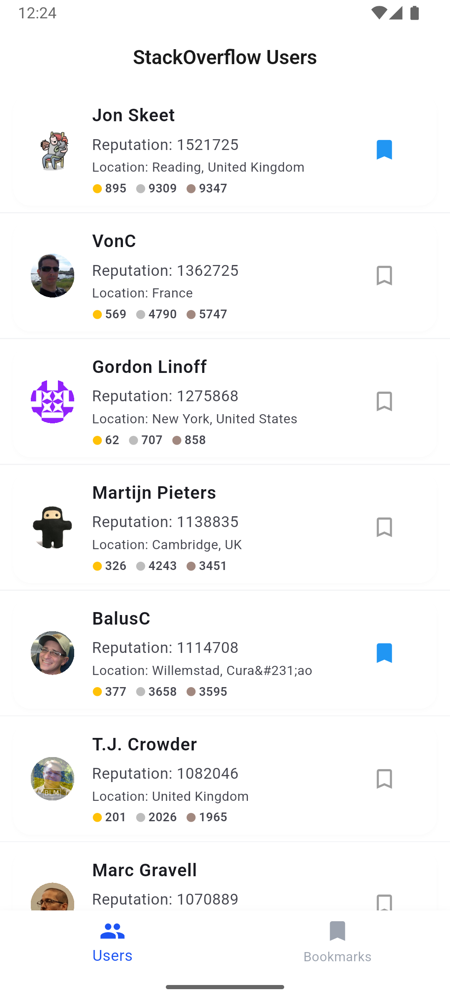
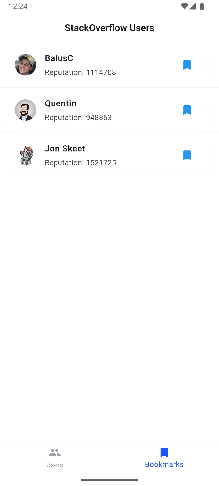
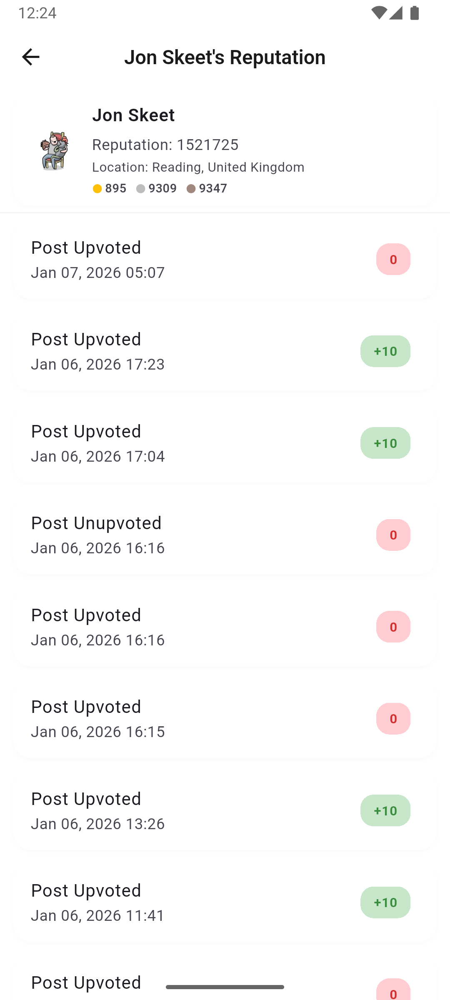

# StackOverflow Users & Reputation App

A Flutter application that displays StackOverflow users and their reputations with a clean, modern UI. Built with clean architecture and modern state management patterns.

## 📋 Overview

This app showcases a well-architected Flutter project using:
- **BLoC Pattern** for state management
- **Clean Architecture** principles
- **Dependency Injection** for testability
- **Infinite Scrolling Pagination**
- **RESTful API Integration** with error handling
- **Local Persistence** for bookmarks

## 📸 Screenshots

| Users List | Bookmarks |
|---|---|
|  |  |

| Reputation Details |
|---|
|  |

## ✨ Features

### 1. StackOverflow User List
- 📱 **Browse Users**: List out all StackOverflow users with infinite scrolling pagination
- 🔄 **Smooth Scrolling**: Application performs smoothly while scrolling down to load more users
- 🔖 **Bookmark Management**: 
  - Users can bookmark/de-bookmark any StackOverflow user
  - Bookmarks are persisted locally and maintained when the app is restarted
- 🎯 **Filter Bookmarks**: Option to view only bookmarked users
- ⚡ **Optimized Performance**: Efficient pagination and caching mechanism

### 2. StackOverflow User Reputation
- ⭐ **Reputation Details**: Click on any user to view their detailed reputation information
- 📊 **Reputation Insights**: Display comprehensive reputation analytics and statistics
- 🔗 **User Profile Integration**: Deep linking to user details from the list

## 🏗️ Architecture

The project follows **Clean Architecture** principles with clear separation of concerns:

```
lib/
├── core/                          # Core functionality and utilities
│   ├── constants/                 # App constants
│   ├── di/                        # Dependency injection setup
│   ├── errors/                    # Error handling and exceptions
│   ├── extensions/                # Dart extensions
│   ├── network/                   # Network configuration & API client
│   ├── routes/                    # Navigation routes
│   ├── storage/                   # Local storage (bookmarks persistence)
│   ├── styles/                    # App styles and themes
│   └── utils/                     # Utility functions
├── modules/                       # Feature modules
│   ├── reputation/                # Reputation feature module
│   │   ├── data/
│   │   ├── domain/
│   │   └── presentation/
│   └── users/                     # Users feature module
│       ├── data/                  # User repositories & data sources
│       ├── domain/                # User entities & use cases
│       └── presentation/          # BLoCs, screens & widgets
├── shared/                        # Shared components
│   ├── data/                      # Shared data models
│   ├── domain/                    # Shared domain models
│   └── widgets/                   # Reusable widgets
└── main.dart                      # App entry point
```

## 🚀 Getting Started

### Prerequisites

- Flutter SDK (3.7.2 or higher)
- Dart SDK
- iOS 11.0+ or Android 5.0+

### Installation

1. **Clone the repository**
```bash
git clone <repository-url>
cd oivan_task
```

2. **Install dependencies**
```bash
flutter pub get
```

3. **Build generated files**
```bash
dart run build_runner build --delete-conflicting-outputs
```

### Running the App

```bash
flutter run
```

## 📦 Dependencies

### State Management
- `flutter_bloc: ^8.1.3` - BLoC pattern implementation for predictable state management

### Dependency Injection
- `get_it: ^7.6.4` - Service locator for dependency injection

### Pagination & UI
- `infinite_scroll_pagination: ^5.1.1` - Infinite scrolling list with pagination support
- `cupertino_icons: ^1.0.8` - iOS-style icons

### Networking
- `dio: ^5.9.0` - HTTP client with interceptor support
- `talker_dio_logger: ^4.9.3` - Network request and response logging

### Local Storage
- Built-in Flutter SharedPreferences for persistent bookmark storage

## 📱 Usage

### Run the app
```bash
flutter run
```

### Run tests
```bash
flutter test
```

### Build release
```bash
# Android
flutter build apk

# iOS
flutter build ios

# Web
flutter build web
```

## 🧪 Testing & Code Quality

### Comprehensive Unit Tests
This project includes extensive unit tests demonstrating **clean code** and **domain-driven design** principles:

- **BLoC Tests** (`user_bloc_test.dart`, `reputation_bloc_test.dart`)
  - State management verification with proper state transitions
  - Event handling and error scenarios
  - Mocking of dependencies using Mockito
  - Tests for pagination, bookmarking, and filtering

- **Domain Use Case Tests** (`user_usecases_test.dart`)
  - Business logic layer testing in isolation
  - Repository abstraction verification
  - Error propagation testing
  - Domain-driven design showcase

#### Running Tests
```bash
# Run all tests
flutter test

# Run unit tests only
flutter test test/unit

# Run tests with coverage
flutter test --coverage

# Run specific test file
flutter test test/unit/modules/users/presentation/bloc/user_bloc_test.dart
```

#### Test Coverage
✅ BLoC state transitions and event handling
✅ Use case business logic
✅ Error handling and exceptions
✅ Edge cases and boundary conditions
✅ Multi-page pagination logic
✅ Bookmark persistence and filtering

For detailed test documentation, see [test/TEST_DOCUMENTATION.md](test/TEST_DOCUMENTATION.md)

### Testing Best Practices
- **AAA Pattern** (Arrange-Act-Assert) for test structure
- **Proper Mocking** using Mockito for layer isolation
- **bloc_test** for comprehensive BLoC testing
- **Single Responsibility** - Each test validates one behavior
- **Clear Naming** - Test names describe expected behavior

## 🏛️ Project Structure Details

### Core Module
Provides foundational services and utilities:
- **DI**: Service locator setup and dependency registration
- **Network**: API client configuration with error handling and logging
- **Storage**: Local persistent storage for bookmarks using SharedPreferences
- **Routes**: Navigation and routing configuration
- **Extensions**: Utility extensions for common operations on strings, widgets, etc.
- **Errors**: Custom error classes and exception handling

### Feature Modules

#### Users Module
- **Data Layer**: 
  - `UserRepository` - Manages user data fetching and persistence
  - `RemoteUserDataSource` - StackOverflow API calls
  - `LocalUserDataSource` - Bookmark storage and retrieval
- **Domain Layer**: 
  - `User` entity with reputation data
  - Use cases for fetching users and managing bookmarks
- **Presentation Layer**: 
  - `UserBloc` for state management
  - User list screen with infinite scrolling
  - User detail screen with reputation information
  - Bookmark filter functionality

#### Reputation Module
- **Data Layer**: Reputation data models and API integration
- **Domain Layer**: Reputation entities and business logic
- **Presentation Layer**: Reputation detail screens and widgets

### Shared Module
Common components used across features:
- Shared data models
- Domain models
- Reusable UI widgets and components

## 🔧 Technical Implementation Details

### Infinite Scrolling & Pagination
- Utilizes `infinite_scroll_pagination` package for seamless user experience
- Automatic loading of next page when user scrolls near bottom
- Proper error handling and retry mechanisms

### Bookmark Persistence
- Local storage using SharedPreferences
- Bookmarks are saved immediately when user toggles
- Bookmarks are loaded on app startup
- Filter functionality to display only bookmarked users

### State Management (BLoC)
- Separation of business logic from UI
- Events-driven architecture
- Predictable state transitions
- Easy to test and maintain

### Network Integration
- Centralized API configuration
- Automatic logging of requests and responses
- Error handling with proper exception mapping
- Timeout and retry mechanisms

## 📝 Code Style

The project follows Dart style guidelines:
- Effective Dart conventions
- Proper null safety throughout
- Meaningful variable and function names
- Well-documented code with comments

## 🔍 How It Works

1. **User Opens App**: 
   - App loads previously bookmarked users from local storage
   - Displays StackOverflow user list with first page of data

2. **User Scrolls**: 
   - App automatically fetches next page of users when scrolling near bottom
   - New users are appended to the list

3. **User Bookmarks**: 
   - Clicking bookmark icon saves/removes user from local storage
   - Bookmark state is immediately reflected in UI

4. **User Clicks on User**: 
   - Navigation to reputation detail screen
   - Display detailed reputation information and statistics

5. **Filter by Bookmarks**: 
   - User can toggle filter to view only bookmarked users
   - List updates to show only bookmarked entries

## 🤝 Contributing

Contributions are welcome! Please feel free to submit pull requests or open issues for bugs and feature requests.

## 📄 License

This project is licensed under the MIT License - see the LICENSE file for details.

## 👨‍💻 Author

Developed as part of the Oivan tech task demonstration.
